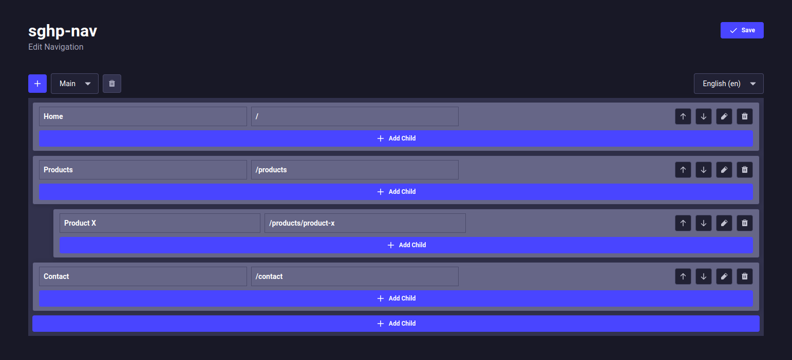

  

# Strapi Plugin sghp-nav 5

Plugin for [Strapi](https://strapi.io/) to create, edit and retrieve website navigation structure.

# Features:

- Graphical user interface for editing site navigation
- i18n, Nationalization: seperate navigation for every locale
- Multiple independent navigations supported (footer, etc)
- Configurable via config file
- Strapi conformant REST API to fetch hierarchical menu data
- Typescript types for REST responses included
- Navigation items may be associated with a custom content type (ie. that represents a page or section on your website)
- Import / Export of navigation structure via strapis native command line tools

# Requirements

- Strapi 5

This is the strapi *5 version* of the legacy (Strapi v4) project [strapi-plugin-sghp-nav](https://github.com/EsGeh/strapi-plugin-sghp-nav).

# Installation

1. Install package from npm:

    - Install via npm:

            $ npm install @sgsoftware/strapi-plugin-sghp-nav-5

    - Install via yarn:

            $ yarn add @sgsoftware/strapi-plugin-sghp-nav-5

2. [Create the necessary configuration](#configuration) as described below.

3. Recompile admin

    $ npm run build

The plugin should now be ready.
Use the admin interface to create or edit navigation structure (url: <http://localhost:1337/admin/plugins/sghp-nav>).
[Query](#query) navigation data via REST.

# Configuration

Add plugin config to `./config/plugins.ts` (create, if not yet existing):

    ...
    'sghp-nav': {
      enabled: true,
      config: {
        relatedType: 'api::page.page',
        relatedDisplayField: 'title',
        hierarchicalPaths: true,
      }
    }

Adjust the values as necessary!

Configuration Options:

- `relatedType`: Menu entries may be associated with entities of a custom content type, e.g. a subpage. Refers to a content type via "strapi uid" in the same format as in [strapis entity service api](https://docs.strapi.io/dev-docs/api/entity-service). `$ npm run strapi content-types:list` lists all content types.
- `relatedDisplayField`: a field of the related type used to display related content in the graphical user interface
- `hierarchicalPaths`: Menu entries consist of a title and a path. The path must be unique. If `hierarchicalPaths` is true, the path of subentries is the concatenation with the path of their parents, e.g. if `/productX` is a subentry of `/products`, the full path is `/products/productX`

# Admin Frontend

Navigation structure may be edited in the browser from <http://localhost:1337/admin/plugins/sghp-nav>.

# REST API

Example Query:

    $ curl -X GET 'http://localhost:1337/api/sghp-nav/navigations/render'

Example Response:

    {
      "data": [
        {
          "id": 6,
          "documentId": "csfeocqquqz2bekl1xycrfkh",
          "name": "Main",
          "createdAt": "2025-01-09T22:06:55.493Z",
          "updatedAt": "2025-01-09T22:06:55.493Z",
          "publishedAt": "2025-01-09T22:06:55.489Z",
          "locale": "en",
          "items": [
            {
              "id": 13,
              "title": "Home",
              "path": "/",
              "subItems": []
            },
            {
              "id": 14,
              "title": "Products",
              "path": "/products",
              "subItems": [
                {
                  "id": 15,
                  "title": "Product X",
                  "path": "/products/product-x",
                  "subItems": []
                }
              ]
            },
            {
              "id": 16,
              "title": "Contact",
              "path": "/contact",
              "subItems": []
            }
          ]
        }
      ],
      "meta": {
    
      }
    }

Request Format:

    http://localhost:1337/api/sghp-nav/navigations/render?<PARAMS>

Get Params:

- `locale`: Query the navigation for a specific locale. If unspecified, returns default locale
- `populateRelated`: specifies what information to return for related entities. The format is exactly as in a [REST request](https://docs.strapi.io/dev-docs/api/rest/parameters) for the corresponding content type. Most notable operators are: `populate` and, `fields`.

# Query from Frontend

There is a npm package that provides the correct typings for the REST response.
This will add autocompletion and typesafety to your frontend. Hooray!

To install it, `cd` to your prontend package and issue:

- Install via npm:

        $ npm install @sgsoftware/strapi-plugin-sghp-nav-5-front

- Install via yarn:

        $ yarn add @sgsoftware/strapi-plugin-sghp-nav-5-front

The following code snipped shows how to fetch navigation data from the strapi backend via REST.

    import * as qs from 'qs';
    import * as front from '@sgsoftware/strapi-plugin-sghp-nav-5-front';
    import fetch from "node-fetch";
    
    const query = {
    	populateRelated: true
      // alternatively:
      //   populateRelated: {
      //      fields: ...
      //      populate: ...
      //   }
    } as const;
    
    type Args = typeof query;
    type PageType = {
      title: string,
      content: string,
    };
    type Navigation = front.RestReturnRender<Args, PageType>["data"][number];
    type Item = Navigation["items"];
    
    const argsString = qs.stringify( query );
    
    const url = `http://127.0.0.1:1337/api/sghp-nav/navigations/render?${argsString}`;
    fetch( url )
    .then(res => res.json())
    .then((json: front.RetReturnRender<Args>) => {
    
      /**************************************
      * DO STH WITH NAVIGATION DATA...
      *    json.data.<...>
      ***************************************/
    
    })
    .catch( error => {
      throw Error("Error fetching navigation data!");
    });

# Contribution

Comments, bug reports and pull requests welcome.
Effort has been taken towards well structured code that should be easy to extend and improve.

# References

- [strapi-plugin-navigation](https://github.com/VirtusLab-Open-Source/strapi-plugin-navigation)
- [types-4-strapi-2](https://github.com/Oak-Digital/types-4-strapi-2) 
